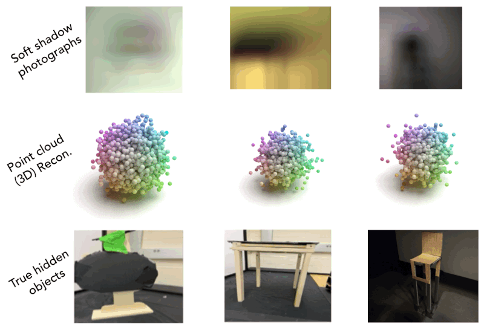

<div align='center'>
<h1>Soft Shadow Diffusion (SSD): Physics-inspired Learning for 3D Computational Periscopy</h1h1>
<h3></h3>

[Information Science and Computational Imaging Lab, University of South Florida](https://cse.usf.edu/~murraybruce/ISCI-Lab.html)

| [Project Page](https://predstan.github.io/SSD/) | [Paper](https://www.ecva.net/papers/eccv_2024/papers_ECCV/html/10427_ECCV_2024_paper.php) |

</div>

<div align='center'>
  
</div>


We introduce **SSD**, a novel diffusion model for reconstructing 3D models  directly from shadows. The reconstructed 3D model allows us to reconstruct the objects reflecting lights behind it as a 2D image. The model is solely trained with simulated 2D, and 3D data.

### SSD excels both in the real world and simulation
**SSD** 

<div align='center'>

</div>

### Highlights

- **SSD** is capable of generating high-quality 3D models from shadows
- **SSD** with TV regularized inversion of the forward model, 2D image of the light source can be reconstructed


### TODO


- [X] Release the inference code.
- [x] Release the evaluation code.
- [X] Release training scripts
- [] Release model weights 


### Setup

Clone this repository and install required packages:

```shell
conda create --name SSD -y
conda activate SSD
git clone git@github.com:iscilab2020/Soft-shadow-diffusion.git
cd Soft-shadow-diffusion
```

### SDF Model
First install the SDF model that helps us generate 3D mesh from pointcloud
```shell
cd sdf_model
pip install -e .
```

### SSD Model
Next, Install SSD that generates pointcloud from shadow images
```shell
cd ..
pip install -e .
```


### Demo
You can now run the demo

```shell
python demo.py
```

Please note that the output of demo is a dictionary. There are four real world shadow photographs being used for reconstruction.

```python
scenes = {"ball_smiles":{"measurement":"measurements/ball_on_smile.pt",
                         "occluder_size":(0.1, 0.1, .1)}, 
           "ball_complex":{"measurement":"measurements/ball_on_complex.pt",
                           "occluder_size":(0.1, 0.1, 0.1,)},
            "real_chair":{"measurement":"measurements/random_real_ball_on_chair.pt",
                          "occluder_size":(0.15, 0.02, 0.22,)},
            "random_mush": {"measurement":"measurements/random_on_mush.pt", 
                            "occluder_size":(0.15, 0.02, 0.22,)} }
```

After the reconstruction process, the dictionary will include new keys 

```python
measurements["pointcloud"] = pc.numpy()
measurements["mesh"] = (np.asarray(mesh.vertices), np.asarray(mesh.faces))
measurements["scene"] = measurements["scene"] = scene_.cpu().numpy()
```

If you have new measurement, you may include it in a similar format. ".pt" measurement are the processed image (1, 128, 128, 3) saved as torch.save(image, "m.pt")

As mentioned in the main paper, we use relative size of the occluder to estimate the location of the 3D object after reconstruction. 
If you are only reconstructing the object casting shadows, this may not be neccessary


